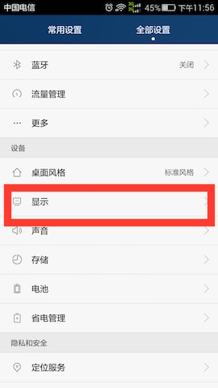
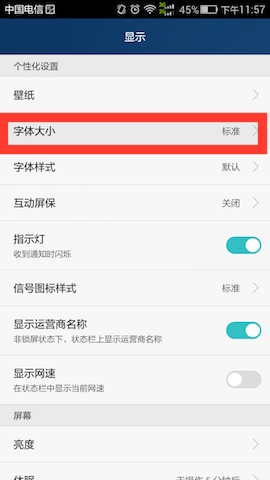

Android常用的尺寸单位：

- px：像素，显示的基本单位。

当屏幕尺寸固定，像素越多，一个像素（1px）的物理尺寸（如毫米，厘米等）越小，屏幕越细腻。分辨率（如：720x1280）指的是：屏幕宽和高方向的像素数量。屏幕尺寸一定时，分辨率低的时候，可以看见像素点（一个个的小方格，真心不爽）。太高也没有实际用处，只能增加机器负担。

- dpi: dots per inch(每英寸像素数量)

	dpi = px / inch

- density:  android像素密度 单位是1  

	density = android设备的dpi  / 160 dpi

- scaleDensity: 缩放像素密度

	scaleDensity = scale * density  
	在Android手机设置的显示设置中,  设置的字体大小为标准时，scale=1；字体大小为特小，小，大等情况时，scale会适当的缩小或变大。

  


- dp（dip）：独立像素，Android系统的特有单位。

	1dp = density  *  1 px  
	1dp 的长度为1/160 英寸  
	以dp为单位，在任何Android手机上（不管屏幕的分辨率大小），显示的物理尺寸都是相同的。  

- sp:  Android系统的特有单位，多用于字体。  

	1sp = scaleDensity  *  1 px  
	和dp的效果相同，无论在任何分辨率的屏幕上，显示的物理尺寸都是相同的。    

    _**用这个单位设置字体时，当用户习惯看大字体，在系统中将字体大小为大时，应用中的字体也会按比例放大。** _ 
	
- hdpi，xhdpi, xxhdpi, xxxhdpi  

```
hdpi，xhdpi, xxhdpi, xxxhdpi的dpi值在android.util.DisplayMetrics中定义。不是简单的翻倍递增关系。
public static final int DENSITY_HIGH = 240;  1dp = 1.5px
public static final int DENSITY_XHIGH = 320;  1dp = 2px
public static final int DENSITY_XXHIGH = 480; 1dp = 3px
public static final int DENSITY_XXXHIGH = 640; 1dp = 4px
```

------------------

**例子：**
  显示一个0.5英寸大小的字  
- 在每英寸有320个像素的手机上，字体大小为：160px(80dp)  
- 在每英寸有480个像素的手机上，字体 大小为：240px(80dp)  

**结论：**
不论手机分辨率高低（像素密度高低），以dp为单位设置尺寸，
在各个手机上显示出的物理尺寸（英寸，厘米）是一样的。 

**优点：**
看着都是一样大。  
**缺点：**
一个view的宽为2英寸  
在屏幕宽4英寸的手机上，view占屏幕的50%  
在屏幕宽8英寸的手机上，view占屏幕的25%  

------------------

**结论：**

正常情况下，所有的单位都用dp，字体用sp。  
但是字体使用sp会引起界面原有的设计被打破，变得比较丑甚至惨不忍睹。  
**_微信的字体大小用的就不是sp, 改变系统文字大小就不会引起微信字体大小的改变。_ **   
**我推荐字体单位使用dp, 使用TextView的setTextSize方法要指定单位类型为dp（因为默认的是sp）。这样可以避免字体太大显示不全等（可以自己修改一下系统的字体大小，测试一下常用app的字体显示问题）。**

如果特定的情况view的大小是屏幕的百分之几的话，这时候用权重。
或者，获取屏幕的总宽，计算view的大小。
